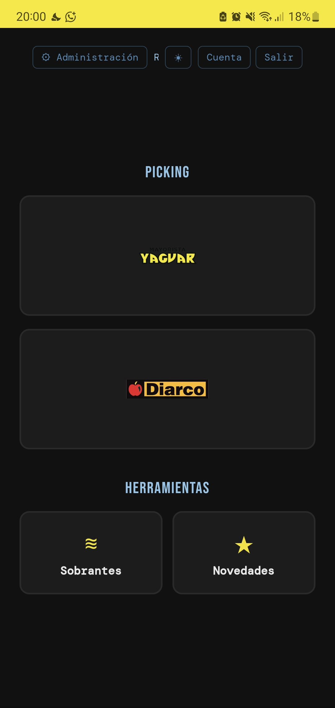
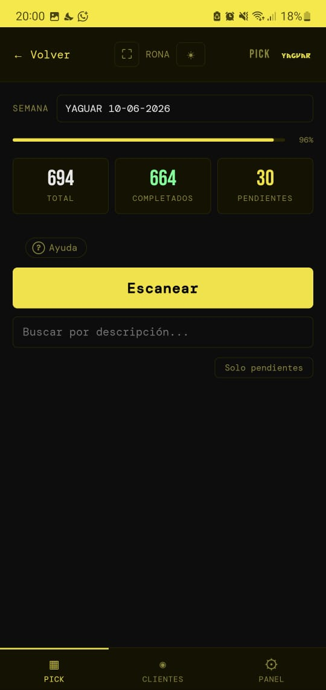
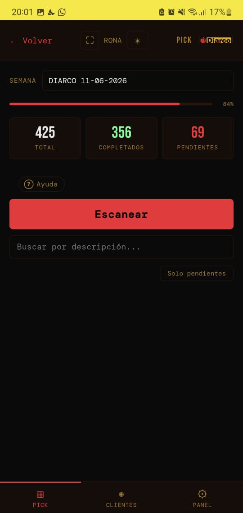
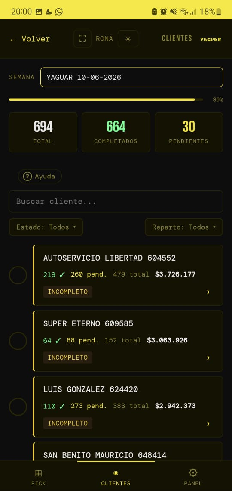
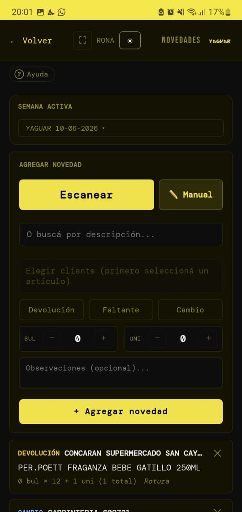
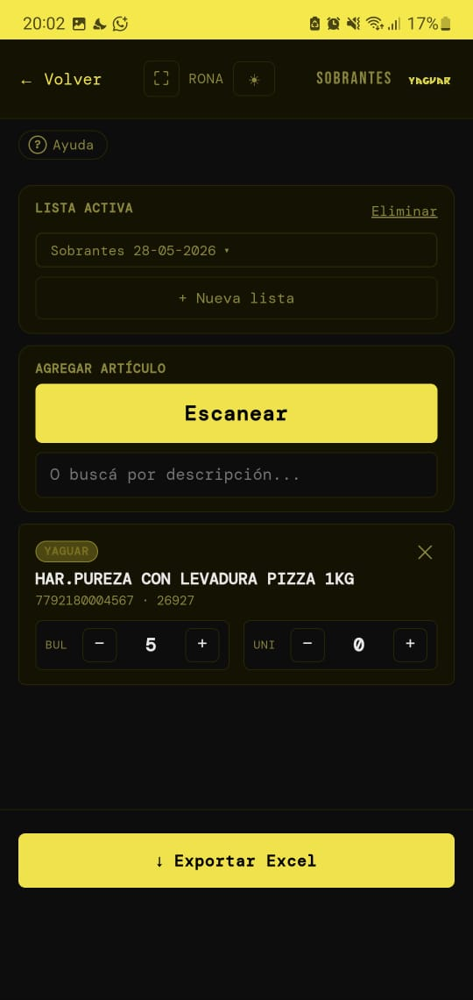
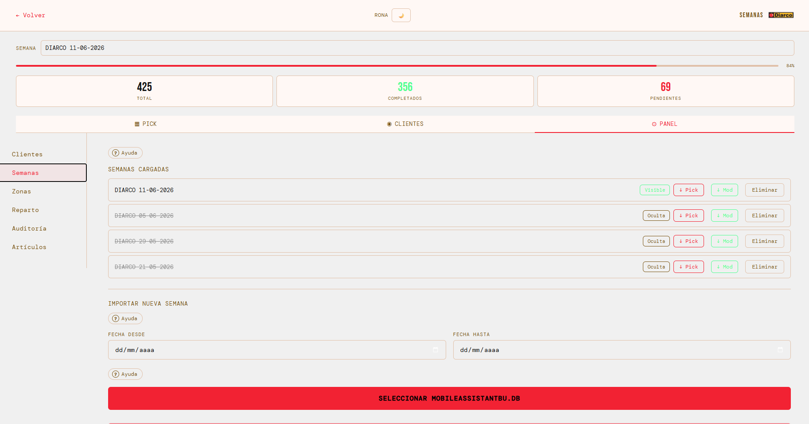
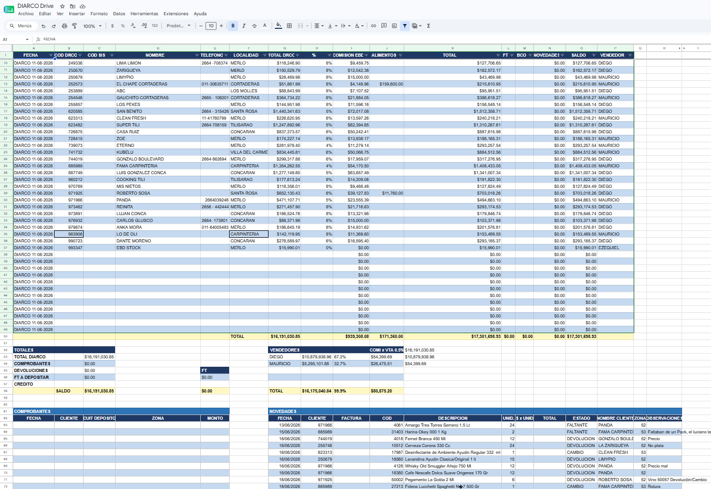

<div align="center">
  
  <h1>Pick</h1>
  <p><strong>Cross-docking warehouse management system</strong><br>
  In production at EBD Envases · San Luis, Argentina</p>

  
  
  
  
  
  
</div>

---

## The Problem

In warehouse cross-docking operations, manually separating merchandise ("picking") for each customer is the biggest bottleneck. With dozens of customers and hundreds of products arriving from two wholesale distributors — each with its own invoicing rules, delivery routes, and product codes — the process was slow, error-prone, and impossible to track in real time.

## The Solution

**Pick** is a mobile-first web application that digitizes and coordinates the entire picking workflow. Used daily by warehouse workers at EBD Envases, it has reduced picking time by up to **65%**.

Operators scan product barcodes from their phones, track progress per customer and per delivery route, log product shortages or returns, and managers automatically receive a formatted Google Sheets report — all without paper, spreadsheets, or manual coordination.

## Screenshots

**Mobile workflow**

| Main hub | Picking (Yaguar) | Picking (DIARCO) | Customer view |
|----------|-----------------|-----------------|---------------|
|  |  |  |  |

**Features & integrations**

| Exceptions | Surplus | Week import | Google Sheets report |
|------------|---------|-------------|----------------------|
|  |  |  |  |

## Features

### Core Picking Workflow
- **Barcode scanning** via device camera — ZXing multi-format decoder (EAN-13, EAN-8, CODE128, UPC-A and more)
- **Weekly pick cycles**: import distributor data → workers scan and mark deliveries → reports auto-generate
- Full and partial delivery marking with unit/box quantity breakdown (UxB)
- **Customer view**: group all picks by customer, mark as packed separately, sort by invoice amount
- Multi-select delivery route filter to focus on one zone at a time
- Real-time progress bar: items completed / total per session

### Dual-Distributor Support
- Manages two wholesale distributors (**Yaguar** and **DIARCO**) with fully isolated workflows from one app
- Automated weekly data import from distributor-generated SQLite databases
- Each distributor has its own business rules: code pools, zone matching logic, freight percentages, EAN-13/EAN-14 barcode formats

### Admin & Management
- Role-based access control: 3 tiers (Operario, Admin, Superadmin) with **13 granular permissions**
- Full audit log of all pick modifications with barcode scanner support
- Delivery zone and route management with custom order configuration
- Customer database with vendor assignment, contact info, freight %, Factura A flag
- User management with per-user permission overrides

### Reporting & Integrations
- **Google Sheets auto-generation** on every weekly import: MOD sheet (commissions model) + PICK sheet (full pick list), with color-coded active week tabs
- **Live exceptions sync**: product changes (returns, shortages, substitutions) are written to Sheets in background threads without blocking the UI
- **Excel exports** with professional styling (openpyxl): pick lists, MOD sales models, customer lists, product catalogs
- **Surplus management**: named surplus lists with barcode lookup and Excel export

### Mobile-First UX
- PWA-capable — add to home screen on Android/iOS
- Distributor themes: Yaguar yellow `#F2E205` / DIARCO red `#F22233`, plus light/dark mode toggle
- Wake lock prevents screen sleep during scanning sessions
- Flashlight toggle and multi-camera support for scanning in warehouse conditions
- 10-minute auto-lock for shared devices, JWT session management

## Tech Stack

| Layer | Technology |
|-------|-----------|
| **Frontend** | HTML5, CSS3, Vanilla JavaScript — no framework, no build tools |
| **Backend** | Python 3.12, FastAPI, Uvicorn |
| **Database** | PostgreSQL 16 |
| **Auth** | JWT tokens, bcrypt password hashing |
| **Integrations** | Google Sheets API (gspread), Excel export (openpyxl) |
| **Infrastructure** | Docker, Docker Compose, nginx (SSL) |
| **CI/CD** | GitHub Actions |

## Architecture

```
Browser (mobile phone)
        │
        ▼
   nginx  (SSL/TLS)
        │
        ├─── /api/* ──► FastAPI :8000 ──► PostgreSQL :5432
        │                    │
        │                    └──► Google Sheets API
        │                         (background threads — non-blocking)
        │
        └─── /*  ──► index.html (single-page app)
```

The entire frontend is one HTML file with a companion `app.js` handling all state — no build step, no bundler. The backend exposes a RESTful API with separate endpoint trees per distributor. Google Sheets sync always runs in background threads so it never blocks the warehouse workflow.

## Getting Started

### Prerequisites
- [Docker](https://docs.docker.com/get-docker/) + Docker Compose
- *(Optional)* A Google Cloud service account JSON with Sheets API access (for report generation)

### Local Setup

```bash
git clone https://github.com/rona891/pick.git
cd pick

# Configure environment
cp backend/.env.example backend/.env
# Edit backend/.env with your values (see comments inside)
```

If you have a Google service account JSON, place it at `/data/<your-sa-file>.json` (path configured in `.env`). The app runs without it — Sheets sync is simply skipped.

```bash
docker-compose up --build
```

Open **https://localhost:3000** (self-signed SSL — accept the browser warning in dev).

Default admin credentials are configured via `ADMIN_PASSWORD` in your `.env`.

> Weekly pick data comes from importing `.db` files exported by the distributors' own mobile apps. Without those files, the picking workflow is empty — which is expected in a fresh dev setup.

## Project Status

✅ **In production** — used daily at EBD Envases, San Luis, Argentina  
🔄 **Actively maintained** — new features and bug fixes ship regularly  
📦 **Two distributors** in production: Yaguar and DIARCO  

---

<div align="center">
  Built with <a href="https://github.com/anthropics/claude-code">Claude Code</a>
</div>
